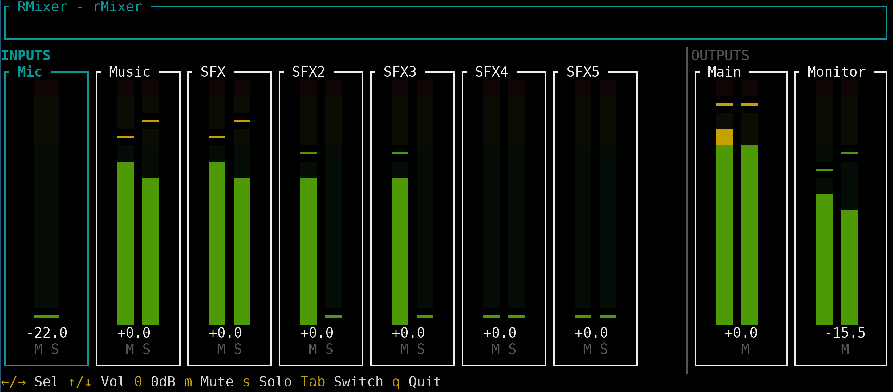

# RMixer - JACK Audio Mixer

A low-latency audio mixer application for JACK with a terminal user interface. Written in Rust.



## Features

- **Configurable Ports**: Define input and output ports in YAML format
- **Real-time Level Meters**: Visual dB level indicators with green/yellow/red zones
  - Green: < -12 dB
  - Yellow: -12 dB to 0 dB
  - Red: ≥ 0 dB (clipping)
- **5-Second Peak Hold**: Visual peak indicators with decay
- **Volume Control**: -60 dB to +12 dB range with 0.5 dB steps
- **Mute & Solo**: Per-channel mute and additive solo (inputs only)
- **Mono/Stereo Support**: Channels can be mono (1 port) or stereo (2 ports)
- **Volume Persistence**: Volume levels are saved to config file on exit
- **Manual Connections**: Ports are exposed for manual connection via `jack_connect`, `qjackctl`, etc.

## Requirements

### Build Dependencies

```bash
# Debian/Ubuntu
sudo apt install build-essential libjack-jackd2-dev libclang-dev

# Fedora
sudo dnf install gcc jack-audio-connection-kit-devel clang-devel

# Arch
sudo pacman -S base-devel jack2 clang

# NixOS
# Dependencies are handled automatically via the Makefile
```

### Runtime Dependencies

- JACK server (running via `jackd`, `pipewire-jack`, or similar)

## Building

```bash
make build        # Debug build
make release      # Release build
```

Or directly with cargo (non-NixOS):

```bash
cargo build --release
```

## Usage

```bash
rmixer --config config.yaml
```

### Command Line Options

- `-c, --config <PATH>`: Path to configuration file (required)
- `-v, --verbose`: Enable verbose logging
- `-h, --help`: Print help
- `-V, --version`: Print version

## Configuration

Configuration is done via a YAML file. See `config.example.yaml` for a full example.

```yaml
# JACK client name
client_name: "Mixer"

# Input channels to mix
inputs:
  - name: "Mic"           # Display name
    ports:
      - "mic_in"          # Mono: single port

  - name: "Music"
    ports:
      - "music_in_L"      # Stereo: two ports
      - "music_in_R"

# Output channels (receive sum of all inputs)
outputs:
  - name: "Main"
    ports:
      - "main_out_L"
      - "main_out_R"
```

Ports are exposed as `{client_name}:{port_name}`, e.g., `Mixer:mic_in`.

Volume levels are automatically saved to the config file on exit and restored on next startup:

```yaml
inputs:
  - name: "Mic"
    ports:
      - "mic_in"
    volume_db: -6.0       # Optional: saved volume level
```

## Controls

| Key | Action |
|-----|--------|
| `←` / `→` | Select channel |
| `↑` / `↓` | Adjust volume (±0.5 dB) |
| `0` | Reset volume to 0 dB |
| `m` | Toggle mute |
| `s` | Toggle solo (inputs only) |
| `Tab` | Switch between inputs/outputs |
| `q` / `Esc` | Quit |

## Connecting Ports

RMixer does not auto-connect ports. Use external tools to make connections:

```bash
# List available ports
jack_lsp

# Connect ports
jack_connect "Mixer:mic_in" "system:capture_1"
jack_connect "Mixer:main_out_L" "system:playback_1"
jack_connect "Mixer:main_out_R" "system:playback_2"
```

Or use graphical tools like `qjackctl`, `qpwgraph`, or `helvum`.

## Architecture

```
┌─────────────────────┐         ┌─────────────────────┐
│    Audio Thread     │         │     UI Thread       │
│                     │         │                     │
│  JACK Process       │◄───────►│  ratatui + crossterm│
│  Callback           │  rtrb   │  Event handling     │
│  Level metering     │         │  Rendering          │
└─────────────────────┘         └─────────────────────┘
```

- **Lock-free communication** via `rtrb` ring buffers
- **Real-time safe** audio processing (no allocations in audio callback)
- **Synchronized I/O**: Single JACK process callback handles all inputs and outputs
- **60 FPS** UI refresh rate

## License

MIT
